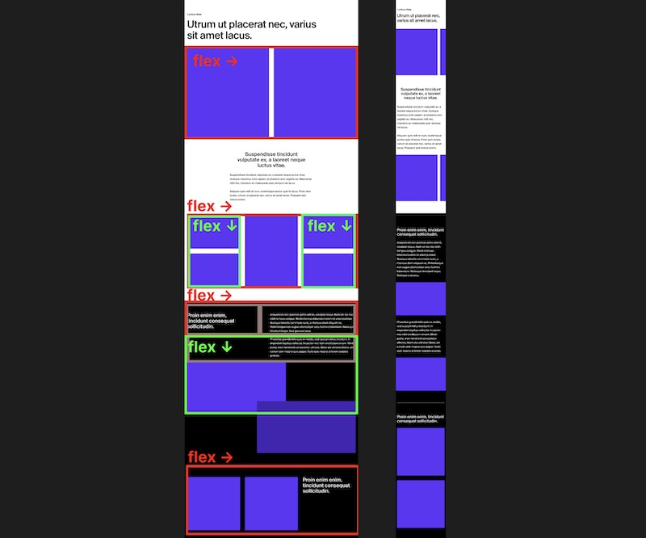

## Assignment explanation

### Visual slicing of layout

First thing I did was slice up the layout visually (just on a regular Figma board) to figure out the Flexboxes.

At first I thought CSS grid would be needed since the structure felt quite different between desktop/mobile, but then realized that almost all of it can be done with flexbox:

### Tailwind

Decided
