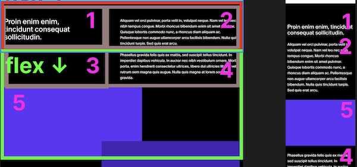

### Install

`yarn` & `yarn dev`

### Visual slicing of layout

First thing I did was slice up the layout visually (just on a regular Figma board) to figure out the Flexboxes.

At first I thought CSS grid would be needed since the structure felt quite different between desktop/mobile, but then realized that almost all of it can be done with flexbox:

### Numbering

The bottom part structure is a bit more tricky so I gave numbers to each section to see what would change in different viewports:

Note how item 3 is just a flex placeholder and that 4 and 5 switch flex direction. One could argue that CSS grid is better adapt for this by specifying grid-column-areas but personally I find the simplicity of flexbox allows for easier understanding of the layout - it's just layered flexboxes instead of creating complex css grids.
